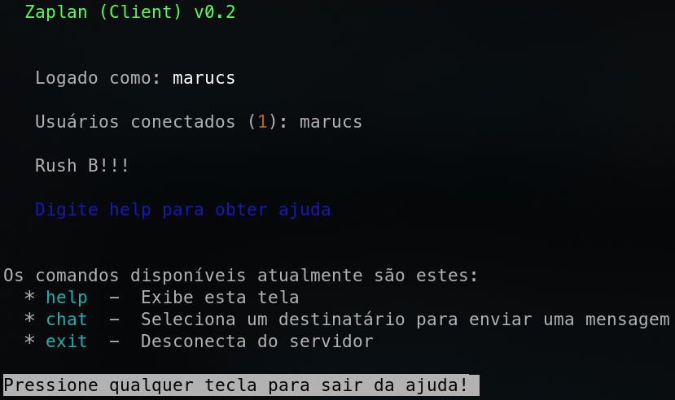
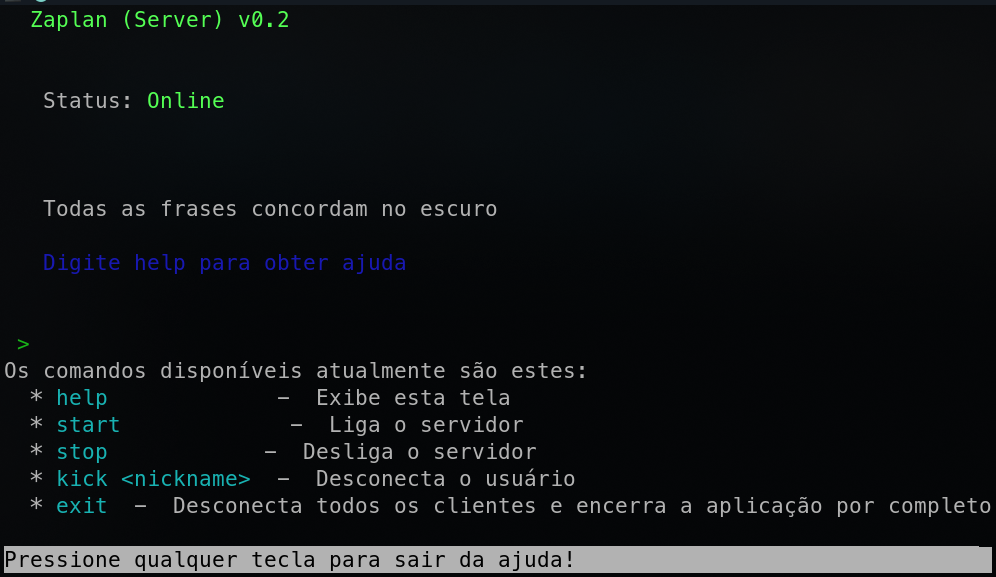
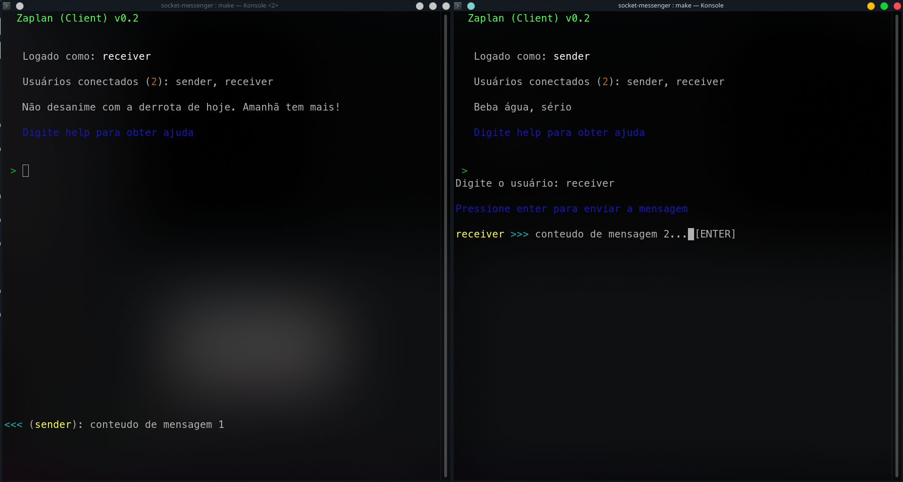

# Zaplan (Socket LAN Messenger)

Zaplan is a C++ academic project developed as an assignment for SSC0142 - Computer Networks at USP - São Carlos.

It's name is a joke combining the coloquial name of WhatsApp ("Zap") and LAN (Local Area Network).

The idea of the application is to implement sockets and threads in C++. This is done by means of a messenger application.

### Group members

- [Marcus Vinicius Castelo Branco Martins](https://github.com/marcuscastelo) - 11219237
- [Dalton Hiroshi Sato](https://github.com/daltonsato) - 11275172
- [Vitor Souza Amim](https://github.com/VitorAmim) - 11218772

## Usage

It's a TUI (Terminal User Interface) application with a interactive prompt and some specific areas for notifications.

[Demonstrative video](github/full_video.mkv)


### Available commands

#### Client

#### Server



### Send (Right) & Receive (Left) example



sender types `chat`, `receiver` and then `conteudo da mensagem 2...`.
when sender hits enter, the message is sent to receiver.

## Installation

## Linux - Tested on Arch Linux x64

You will need a C++17 compiler (preferably **g++**) and **make** (GNU Make) to build the project. 

First, clone the repository with ```git clone https://github.com/marcuscastelo/socket-messenger``` to wherever you like.

Just type `make bin/client` or `make bin/server` (GNU Make must be version 4.2 or newer).

The resulting binaries will be in the `bin` folder

If you are using GNU Make 4.3 or newer, there are also these make rules for compiling and running (useful for debugging): `make run client` and `make run server`

### Build, Run and Debug with VSCode

Optionally, one can use Visual Studio Code to build, run and debug the application. Just open the clonned folder with VSCode and you are ready to go (.vscode folder is within the repository).

### Tested tools version

- Linux: Arch Linux - kernel 5.10.42-1-lts
- g++ (GCC) 11.1.0
- ldd (GNU libc) 2.33
- GNU Make 4.3
- Code - OSS version 1.56.2

## Windows

This project won't work on Windows directly, since it uses a lot of POSIX and unix-only headers (e.g. sys/socket.h).

Maybe WSL can handle it, but I didn't test it.

## Other systems

Currently other systems are not oficially supported, but you can try to install on it and see if it works.

## Networking concepts

The application is separated between **client** and **server**. They both communicate directly, with no Application Level protocol, just using **TCP/IP**.

The group decided to use TCP as the Transport Layer Protocol because we think a messenger application is not a real-time application for it's text messages, and also those messages must be fully integrally received. 

## Network Flow

Standard communication is the following:

1. Server starts
2. Server listens for connections
3. Client 1 connects to server
4. Client 1 sends a **unique** username it will be using
5. Server accepts or reject the sent username (informing the client in the case of rejection, and step 4-5 repeats)
6. Client 1 is fully authenticated and is identifyable
7. Client 2 connects to server
8. Steps 4-6 for Client 2
9. Client 2 sends the payload `msg=Client_2:Client_1:message content`
10. Server receives the payload, checks if sender, receiver and message are valid.
    1. If sender invalid, Server rejects payload, informing Client 2 it's nickname is different from payload.
    2. If receiver is not found in server's local storage, the server informs Client 2 that the destination nickname is offline or does not exist